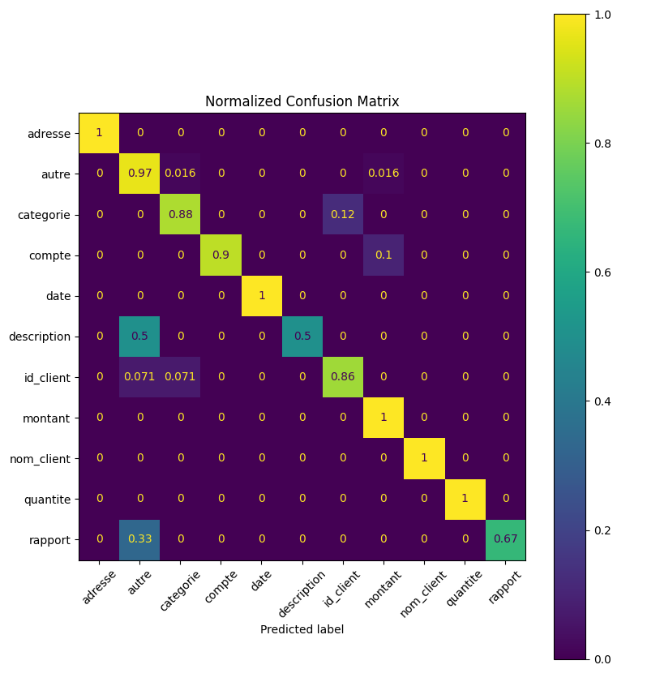
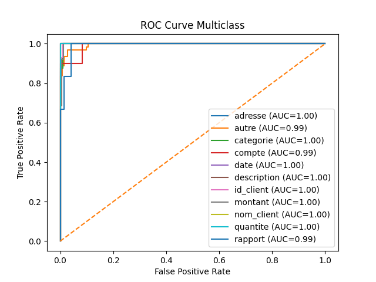
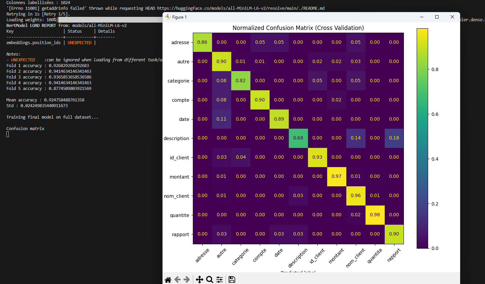
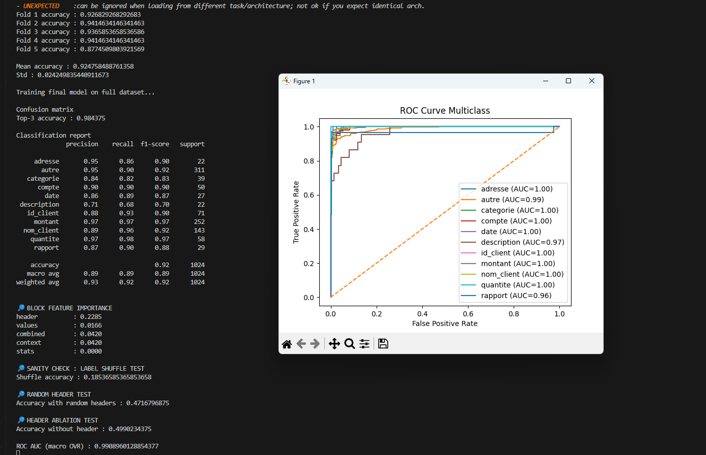

# AI_chatbot_local_with_tool_to_manipulate_excel

The goal is in the end to make an simple chatbot with tool to manipulate, extract information from an excel file or multiple excel file to et inforamtion from them or to transform this data into an new file , much quicker than doing everything by end.

Timeline of the project :

                                    Making an extract model in python to capture the wanted data 
                                                                  |
                                Making the interface and an chatbot to pass input into the extracting model 
                                                                  |
                                                          Deploy the model 
                                                                  |
                                                      Adding new tools gradually 

Not putting all the detail step for each of this projet like fine tuning, dataset generation ...

#

# First step : Extract model

  
  

The model present already some pretty good result that come from his architecture because I'm using an SentenceTransformer which encode with good result the word. Thus my model is really doing embedding + logistic regression, its already a linearly classifier on embedding. The pipeline looking like that : 

                                                        header embedding
                                                              +
                                                        value embedding
                                                              +
                                                        column statistics
                                                              =
                                                      logistic regression
                                                        
But it encounter some basic error such has too much representation of certain class and some other under represented which make noise in the dataset. The training set and testing is not really independant, not k cross validation, normalising my stats and inputting and confidence threshold ... 

# Infusing new features to the model, SMOTE, K-fold validations, Normalisation of all the features and multiple sanity test to check for data leakage or overfitting

  
  

